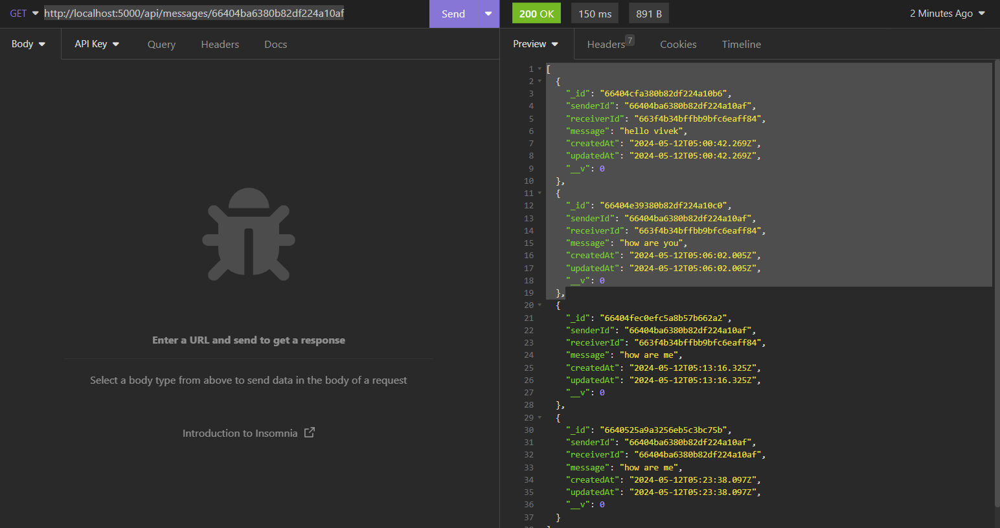

# CHAT-APPLICATION

This project is a real-time chat application built using Node.js for managing user interactions, messages, and user authentication using JWT."

## Installation

1. Clone the repository:

    ```bash
    git clone https://github.com/VIVEKJHA7777/airtribe.git
    ```
3. Install dependencies:

    ```bash
    npm install
    ```

### Setup .env file

```js
PORT=
MONGO_DB_URI=
JWT_SECRET=
API_KEY=
NODE_ENV=development
```


### Start the app

```shell
npm start
```

## Endpoints

### Authentication Route

## Signup route

- **URL**: `http://localhost:5000/api/auth/signup`
- **Method**: `POST`
- **Description**: Handles user signup by validating input, hashing the password, creating a new user instance,
                  saving it to the database, generating a JWT token, and setting the token as a cookie in the 
                   response.

- **Request Body**:
  ```json
   {
	"fullName":"john Doe",
	"email":"johnDoe123@gmail.com",
	"password":"123",
	"confirmPassword":"123"
   }
  ```
- **Response**: 
  - Status: `201 Created`
  - Body:
    ```json
    {
	"_id": "6640a829ea504e3e87f4dc9f",
	"fullName": "john Doe",
	"email": "johnDoe123@gmail.com"
    }
    ```
## Login route

- **URL**: `http://localhost:5000/api/auth/login`
- **Method**: `POST`
- **Description**: Manages user login by finding the user with the provided email, validating the password, updating the user's status to online, generating a JWT token, and setting the token as a 
cookie in the response.

- **Request Body**:
  ```json
   {
	"email":"johnDoe123@gmail.com",
	"password":"123"
   }
  ```
- **Response**: 
  - Status: `200 Created`
  - Body:
    ```json
    {
	"_id": "6640a829ea504e3e87f4dc9f",
	"fullName": "john Doe",
	"email": "johnDoe123@gmail.com"
    }
    ```

## Logout route

- **URL**: `http://localhost:5000/api/auth/logout`
- **Method**: `POST`
- **Description**: `Handles user logout by finding the user with the authenticated user ID, updating the user's 
status to offline and busy, clearing the JWT cookie from the response to invalidate the session.`


- **Testing**:
  - Open Postman and navigate to the "API Keys" section.
  - Click on "Create API Key" and follow the prompts to generate a new API key.
  - pass the jwt token in the API key you will get token when you login with the user


- **Content-Type**: `application/json`
- **Authorization**: Bearer <your_JWT_token>

- **Response**: 
  - Status: `200 Created`
  - Body:
    ```json
    {
	"message": "Logged out successfully"
    }
    ```
### Message Route

## Send Message route

- **URL**: `http://localhost:5000/api/messages/send/:receiver_id`
- **Method**: `POST`
- **Description**: Handles sending messages between users. It first checks if the receiver is online and  their status. If the receiver is busy, it uses a language model API to generate an 
appropriate response. If the receiver is available, it saves the message to the database and emits a newMessage event using Socket.IO to notify the receiver.

- **Testing**:
  - Open Postman and navigate to the "API Keys" section.
  - Click on "Create API Key" and follow the prompts to generate a new API key.
  - pass the jwt token in the API key you will get token when you login with the user

- **Request Body**:
  ```json
   {
	"message":"how are you"
   }
  ```
- **Response**: 
  - Status: `201 Created`
  - Description: `if user is login then message will be send`
  - Body:
    ```json
    {
	"senderId": "66404ba6380b82df224a10af",
	"receiverId": "6640a829ea504e3e87f4dc9f",
	"message": "how are you",
	"_id": "6640af96ea504e3e87f4dcaa",
	"createdAt": "2024-05-12T12:01:26.442Z",
	"updatedAt": "2024-05-12T12:01:26.442Z",
	"__v": 0
    }
    ```

    - **Response**: 
  - Status: `201 Created`
  - Description: `if user is not login then message will not be send`
  - Body:
    ```json
     {
	"message": "The user is currently unavailable"
     }
    ```
## Get Message route

- **URL**: `http://localhost:5000/api/messages/:userToChatId`
- **Method**: `GET`
- **Description**: Retrieves the messages exchanged between the authenticated user and another user 
specified by the userToChatId parameter. It retrieves the conversation from the database based on the participants' IDs, populates the actual messages, and returns  them in the response.

- **Testing**:
  - Open Postman and navigate to the "API Keys" section.
  - Click on "Create API Key" and follow the prompts to generate a new API key.
  - pass the jwt token in the API key you will get token when you login with the user


- **Response**: 
  - Status: `200 Created`
  - Body:
    ```json
    [
	{
		"_id": "66404cfa380b82df224a10b6",
		"senderId": "66404ba6380b82df224a10af",
		"receiverId": "663f4b34bffbb9bfc6eaff84",
		"message": "hello vivek",
		"createdAt": "2024-05-12T05:00:42.269Z",
		"updatedAt": "2024-05-12T05:00:42.269Z",
		"__v": 0
	},
	{
		"_id": "66404e39380b82df224a10c0",
		"senderId": "66404ba6380b82df224a10af",
		"receiverId": "663f4b34bffbb9bfc6eaff84",
		"message": "how are you",
		"createdAt": "2024-05-12T05:06:02.005Z",
		"updatedAt": "2024-05-12T05:06:02.005Z",
		"__v": 0
	}
    ]
    ```

## User Route

### Get user route

- **URL**: `http://localhost:5000/api/users`
- **Method**: `GET`
- **Description**: Retrieves a list of users who are currently online, excluding the authenticated user. It queries the database for users with the is_online flag set to '1' and filters out the logged-in user. The controller returns the list of filtered users in the response.

- **Testing**:
  - Open Postman and navigate to the "API Keys" section.
  - Click on "Create API Key" and follow the prompts to generate a new API key.
  - pass the jwt token in the API key you will get token when you login with the user


- **Response**: 
  - Status: `200 Created`
  - Body:
    ```json
	{
		"_id": "66405a55142dcd2cbf9b1b04",
		"fullName": "yash jha",
		"email": "yashjha07777@gmail.com",
		"is_online": "1",
		"status": "available",
		"createdAt": "2024-05-12T05:57:41.239Z",
		"updatedAt": "2024-05-12T06:17:33.801Z",
		"__v": 0
	}
    ```

## Screenshots

* api/auth/signup


* api/auth/login


* api/auth/logout


* api/messages/send/:receiver_id


* api/messages/:userToChatId



* /api/users


   

   
